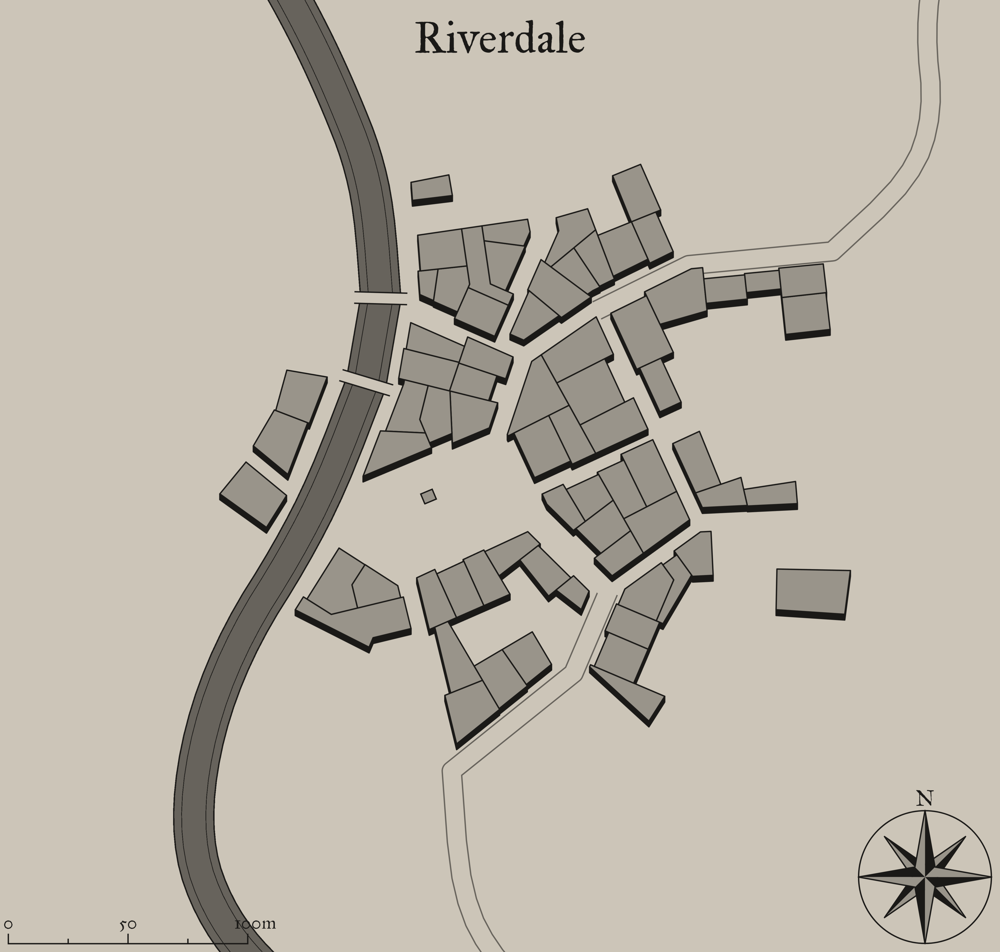

## Raid on the Town
After a long journey the party stumbles upon a small town on the frontier. Surrounded on all sides by a thick forest and with a river at its back. The amptly named **Riverdale** sits in a very precarious location. The forest enveloping it is thick and it, no doubt, harbours a multitude of unseen dangers.

### Hook
> As you unwine in the local inn, you overhear stories of a nearby goblin tribe growing more and more bold. Last week, the goblins raided the blacksmith in the dead of night and made off with a random assortment of tools and weapons. The week before, they attacked the town and only ransacked the storehouse. You are aware of how goblin raiders operate and they have never been known to be so organized. Their strange behavior is all the patrons are talking about.
{.read}

### In the Inn
It is lively but the atmopshere is dire. Everyone is discussing possible solutions to the recent attacks.

**Greg Thompson** approaches and introduces himself to the party. He is the town blacksmith and is rather upset about the recent attacks. Greg offers to buy the party a round of beer to welcome them to town. He offers any information he can and tries his best to make everyone feel welcome. Greg knows where the goblins are storing his tools and is trying to find help to get them back. He will not share this information until he is sure the party is capable.

### An unexpected assault
As the party attempts to gather information from the inn's patrons a goblin raiding party is moving into position for an ambush. A successful DC 12 Wisdom (Perception) check reveals a small silhouette moving through a nearby window. The party starts combat on equal footing with the goblins and initiative is rolled normally. Otherwise, the party and patrons are surprised and the goblins begin combat with initative.

There are 8 other townspeople in the inn with the party and on their turns they will attempt to flee from combat. Greg, on the other hand, will fight alongside the party.

The goblins outnumber the party 2:1. The goblins will attempt to keep a distance and use ranged attacks against the party as often as possible. They will flee once more than half of them have been eliminated.

### Conclusion
If Greg Thompson is still alive, he thanks the players for helping and asks if they would help return his stolen tools and weapons. He provides the players with the location he believes the goblins have taken his goods to, an abandoned crypt deep in the woods. Greg makes it abundantly clear that without these weapons it would be impossible for the town to prepare and mount any defense against future attacks.

>If Greg is dead, the players can find a note about the potential location of his property on his corpse or the corpse of a slain goblin.

### Town Map
