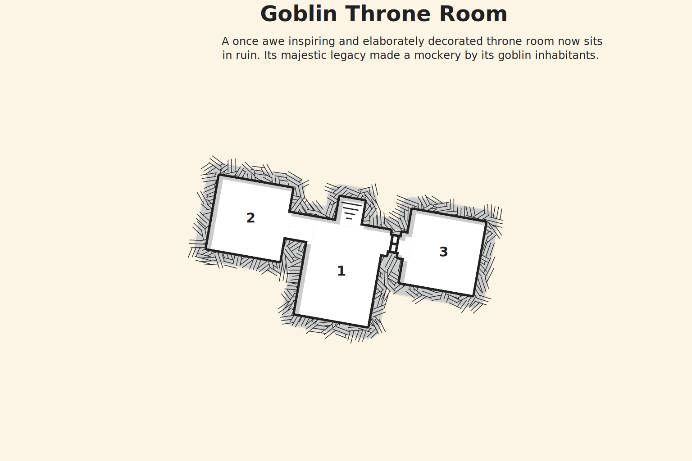

## Goblin King's Throne
At the top of the stairs the characters come face to face with the Goblin King, Torg, a large ogre with a golden crown on his bald head and a large club in his hand. Torg sits on his throne and standing beside him are his two hobgoblin honor guards.

Torg is arguing with Gilena about her inability to kill the characters at the battle for Riverdale. Gilena does not seem impressed. She remains silent until he is finished. This only makes Torg more angry and he begins to yell and slam his club on the ground before her.

At this point both parties notice each other. Gilena tells Torg that now is his chance to kill the characters himself.

## Goblin Throne Room Interior
The following areas correspond to the labels on the provided map.

### 1. Throne Room
A golden throne sits to the south against the wall. A red, dirt stained, carpet stretches from the throne and stops just short of the entrance to the room.

The throne is covered in bones, armor plates, and weapons. Torg sits on it with his club in hand. To either side of him stands a hobgoblin in full plate armor.

Gilena stands off to the side.

To the west is a short hallway that opens up to a smaller room.

To the east, a locked wooden door. A character that succeeds a DC 15 Dexterity check unlocks the door.

### 2. Waiting Room
The room contains benches along the northern and southern walls. Although most are rotting and crumbling a few can still be used as a seat.

In the center of the room is a large worg. A chandelier hangs from the ceiling in the center of the room.

### 3. Treasure Room
An ornate treasure chest sits at the back, near the eastern wall. Light shining from the slits in the walls catches on the gold plating on the chest, causing it to sparkle.

The chest is unlocked and it contains 500 gp and a set of half plate armor.

### Map

### The Final Fight
When combat starts Gilena moves to the back and supports the hobgoblin with her spells. She uses the mage stats.

Torg and his guards will charge the player immediately. The worg in the waiting room (area 2) also joins the fight. A hobgoblin will mount the worg whenever the chance arises.

Once he is at half health Torg will disengage from the players. He will then spend an action to stomp his feet on the ground, causing the ceiling to come down on the characters. Characters must make a DC 12 Dexterity saving throw to avoid the damage. On a failed saving throw they take 3d6 bludgeoning damage. After this attack Torg will engage the characters again in melee.

When Torg is defeated, Gilena will ressurect him as an undead Ogre. After she does this she falls unconscious from exhaustion and is taken out of combat.

## Conclusion
After Torg's defeat, Gilena begrudgingly congratulates the characters. She tells them that the goblin forces here will disperse now that their almighty king has been slain. As Gilena dies a surge of energy erupts from her body. All creatures within 10 feet of her are thrown back and knocked prone. Gilena rises and is reborn as a Lich. She thanks the players for helping her achieve her life's work. She then removes the amulet hanging around her neck, tossing it to the ground, and then disappears.

Once in town the characters can inform Kensey of their successful mission. Kensey will reward the characters with 200 gp and 6 potions of greater healing (2d12 + Constitution modifier). She also hosts a small banquet in the characters' honor.