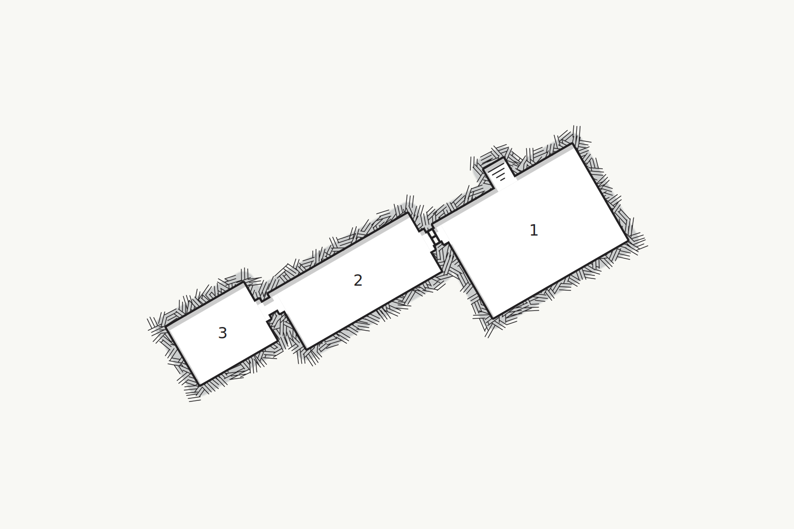

## Description
A man approaches the adventurers, he introduces himself as, **Sigmund Bings**, a retainer for **Salazar DeMontes**. Salazar is a well known and wealthy merchant in the city and he would like to hire the party to help him find the location to a relic. Information about the relic is closely guarded and hidden deep within the city's grand library.

### Hook
Sigmund is an aging but well dressed member of higher society. He will approach the characters when they are alone or in a quiet area with few people around, such as an obscure item shop or a lesser known inn. He will invite the characters to meet with Salazar in person to go over details about the arrangement.

### Meeting Salazar DeMontes
Salazar is an overwieght slob accustomed to getting whatever it is he wanted. Having inherited his wealth from his family, he know nothing about the value of coin. Salazar has indulged in all manners of pleasures and is seeking to find new sensations to explore. When he heard rumors of a magical relic capable of making his wishes a reality, he wasted no time in securing adventures to find it.

The characters meet him in a luxurious bathing hall where they can see many maids tending to his needs.

His sources tell him that the whereabouts of the relic can be found within the city's library. He offers the party 250 gp each for the successfully recovery of information from it. He reveals that the relic is an ornate puzzle box called the Lament.

## The Library
The library has 3 owl constructs that monitor visitors. Each owl flies between the main room (area 1) and the storage room (area 2). If an owl witnesses anyone trying to steal or sneak into the forbidden room (area 3) they will immediately fly to inform the head priest of the library.

The following areas correspond to the labels on the provided map.

### 1. Main Room
A large room with rows upon rows of books organized by categories and authors. Sitting in the front, near the entrance, is a front desk with a dozing off dragonborn priest named **Onkic Frokax**. To the west is a closed wooden door. The door has a small square opening at the top, large enough for a small creature to crawl through.

Onkic has been up all night keeping inventory on all the books in the library's possession and does not notice the characters entering. Onkic has hidden texts within the forbidden room (area 3) that contains information on where the Lament can be found. If he finds out that the characters are looking for this relic he will do everything he can to expel them from the library. Onkic has the key to the forbidden room (area 3) hanging from his belt.

### 2. Storage Room
Shelves line both the northern and souther walls. Books are stacked haphazardly on crates in the middle of the room. Medium creatures can squeeze through the crates and make it to the other side.

a stone door is located to the west and is locked. A character can pick the lock with a successfult DC 15 Dexterify (Sleight of Hand) ability check.

A stone golem stands in the corner where the southern and eastern walls meet. The stone golem is in a dormant state but can be awoken by Onkic when he needs it.

### 3. Forbidden Room
A small table stands against the western wall. A large book with gold trimming sits within a glass case. Four candles, one in each of the 4 corners of the room, are lit with a continual flame spell. The 

The glass case is protected by a glyph of warding. When a creature touches the glass case an explosion erupts from the case. All creatures within 10 feet of the case takes 2d8 thunder damage. A character discovers the glyph on a successful DC 12 Investigation (Intelligence) check.

If Onkic is still asleep, the explosion wakes him and he rushes to this room.

The book in the room holds information on multiple magical artifacts, including the Lament. It is bound shut by a spell and can only be opened after it has been dispelled.

### [Map](https://watabou.github.io/one-page-dungeon/?seed=2086051101&tags=compact,small,dwelling,spacious,single-level,temple)

## Conclusion
Characters return to Salazar after they have successfully escaped from the library with the book. Onkic will seek help from the City Watch. If Onkic was awake while the characters stole the book, the City Watch will know what they look like.

Salazar will take the book from the adventures and reward them for a completed job, he will reach out to the characters when he has unlocked the book.