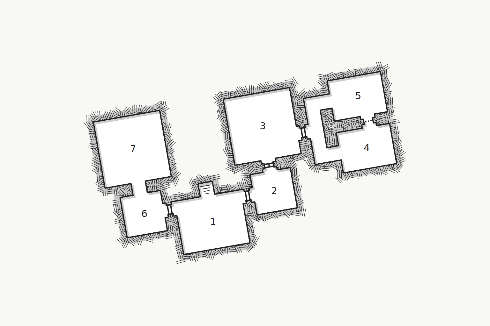

## Description
Salazar sends Sigmund to fetch the characters. At his estate the merchant informs the characters of the last recorded location of the Lament. It is lost in a sunken temple deep in the marshes. Rumor has it the temple is cursed as no one who has entered it has ever returned. Salazar imposes a large reward to motivate the characters to action. If the reward does not work, he threatens to expose the characters as the theives who stole the book from the Library.

### Getting to the Temple
The journey to the temple will take 5 days. As the characters travel they encounter complications. Roll on the table below once per day to determine the obstacle the characters will face that day.

| d6 | Obstacle                                                                                                                                          |
|----|---------------------------------------------------------------------------------------------------------------------------------------------------|
| 1  | A landslide has blocked the path completely. If the party cannot figure out a way over or through it, they must backtrack and find another route. |
| 2  | An overturn cart and dead horse block the road. Several bandits hide nearby and attack anyone that investigates.                                  |
| 3  | A lonely traveler appears on the side of the road. He asks for food and directions to the nearest town.                                           |
| 4  | The path forward is wet and muddy. The party must traverse carefully or risk getting stuck.                                                       |
| 5  | Nearby, a war band of Gnolls are engaged in combat with a small group of human warriors. The party is called upon for help.                       |
| 6  | A unicorn, injured and stuck in a rusty iron bear trap.                                                                                           |

## The Temple
The temple is aged and in decrepitude. The majority of its body has sunken into the marsh. The temple roof is covered by vines and foliage. Two shambling mounds sleep by the entrance. Skeletons and a handful of corpses litter the area before the temple entrance. The shambling mounds come to life when a creature comes within 5 feet. The door to the temple is open and a staircase decends into the darkness.

The following areas correspond to the labels on the provided map.

### 1.

### [Map](https://watabou.github.io/one-page-dungeon/?seed=1774882181&tags=compact,spacious,single-level,temple,tomb,medium,no%20secrets)

## Conclusion
