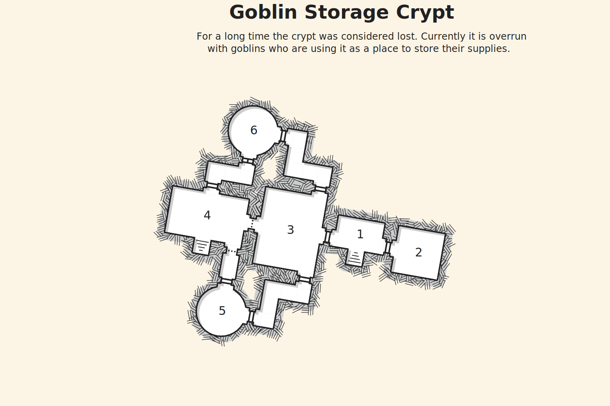

## Recovering the Goods
The characters stumble upon a camp of goblins. At its center is the entrance to a crypt. They can see several wagons parked along side the entrance and goblins unloading crates. The goblins are using this crypt as a staging point for raids on nearby towns and as a warehouse for the spoils of war. Greg Thompson's stolen goods can be found deep within the crypt.

The crypt is dark and traps have been set. Characters should expect a difficult fight.

>You stop just before exiting the treeline. In front of you sits the crypt marked on your map. You can see goblins unloading crates from nearby wagons. Each goblin taking a crate into the crypt. Stand by the crypt's entrance you see four goblins standing watch and talking with one another.
{.read}

### Outside the Crypt
There are four goblins guarding the entrance to the crypt and two additional goblins are unloading a wagon. The two goblins unloading are not armed. The guards are tired from a full night standing at attention and can be surprised easily.

If the characters approach and are sighted, the guards will immediately blow their war horn and initiate combat. The goblins unloading the wagon will flee as soon as combat starts. Two additional hobgoblins will join the fray after a goblin guard is killed. 

When reinforcement appears, the hobgoblins and remaining goblins will attempt to retreat into the crypt. The hobgoblins do whatever they can to help the remaining goblins escape into the crypt before disengaging themselves.

### Crypt Entrance
The crypt's entrance is locked. It is a wood door reinforced with metal binding to give it more endurance. On a successful DC 10 Dexterity check a character picks the lock. Alternatively, a successful DC 12 passive Wisdom (Perception) check will reveal a key hidden on top the door frame.

## Goblin Crypt Interior
The following areas correspond to the labels on the provided map.

### 1. Main Hall
The main hall is muddy and dark. Only characters with a light source or dark vision can make out anything in the darkness.

On the floor to the east is an exposed gravesite, it looks to have been dug up recently. Next to the grave site is a closed wooden door. To the west lies another room closed off by half a door. Upon closer examination, it looks to have been destroyed on purpose.

On a successful DC 9 Wisdom (Perception) check, a character notes that the room smells faintly of oil.

When a character reaches the center of the room, a goblin will appear from the western room and light the oil on the ground with a torch. Any characters caught in the flame takes 9 (3d6) fire damage. The goblin sits behind the broken door and uses it as cover while it attacks the characters with its bow.

### 2. Store Room
The store room is dark and smells of musk. It is packed with barrels along the northern and southern walls. The barrels along the southern wall all contain food items of varying degrees of freshness, while those on the northern wall hold only water.

There is a chest sitting against the eastern wall. It contains miscellaneous adventuring gear such as rope, torches, and ammunition.

### 3. Dinning Hall
Stone coffins lay in two columns. Each of which are consists of three coffins. On top of each coffin sits a multitude of plates, cups, bowls, and crude utensils. A barrel is located to the south-western wall and several pots and pans hang vicariously over a dead fire pit. On a successful DC 12 Wisdom (Survival) check, a character notices that the fire pit has been hastily put out.

A wooden door hidden behind two crates stacked on top of one another lies to the north of the dinning hall. It will lead the characters to the barracks (area 6).

To the west, the characters can make out a small faint glow from the forge room (area 4).

The door to the south is opened to the connecting hallway. It leads to the garden/latrine (area 5).

Bear traps are buried sparingly around the room. All characters that fail a DC 12 passive Wisdom (Perception) check must make a DC 12 Dexterity saving throw or are caught in a bear trap and take 10 (2d10) piercing damage.

A hobgoblin is waiting on each side of the opening to the forge room and a goblin is hiding in a fox hole in the hallway to the south. They attack once a character is caught in a bear trap or any character has reached the center of the room. These goblins fight to the death as they are buying time for their companions to escape.

>Characters caught in a bear trap may spend an action to make a DC 10 Strength (Athletics) check to free themselves.

### 4. Forge Room
A large makeshift forge made from scrap metal and stone sits at the center of the once holy gravesite. To the north-eastern corner of the room there is a large pile of shattered tombstone and grave markers.

The forge is inactive with only embers remaining in its hearth. Several unfinished blades and armor pieces line the stone ring forming the base of the forge. Resting on the base is a longsword that seems to sparkle despite the lack of sunlight.

On a successful DC 10 Wisdom (Insight) check, a character discovers that the sword resting at the forge's base is a magical sword and that it was made by Greg Thompson. The name "Death's Bane" is etched into the side of the blade.

> Death's Bane deals 4 (1d8) slashing damage plus an additional 4 (1d8) radiant damage.

To the south-western corner of the room, racks of weapons are lined neatly against the wall. Shelves of armor flank the western wall with several barrels full of arrows placed where the western and northern walls meet.

To the south a small tunnel leads upwards, it seems the majority of the residents have fled during the fighting. The tunnel leads to the surface several meters away from the crypt's entrance.

A note can be found in this room. It details of an escalating conflict elsewhere and explains why this particular base has so few personnel.

### 5. Garden and Latrine
The smell of waste and refuse hits the characters like a wall of bricks. It is strong enough to make anyone sick. Several pits are dug into the ground and in rows, the disgusting smell seems to be emanating from these pits.

The northern door leads to the forge room (area 4) and the eastern door leads to the dinning hall (area 3).

On a successful DC 9 passive Wisdom (Perception) check, the characters make out what looks like a small garden along the southern wall. Potates and carrots are currently growing under the light coming from several small holes in the ceiling.

### 6. Barracks
Multiple makeshift beds are spread about along the floors of this room. Several pieces of clothing lay haphazardly along the walls and on several of the beds. Everything is in disarray and suggests that the occupants either don't care or have left in a rush.

The southern door can only be opened from the other side and it leads to the forge room (area 4).

The eastern door is stuck open and leads to the dinning hall (area 3).

A chest containing 3d10 gp, 1d6 vials of acid, and 2 1d4 potions of healing is hidden under some blankets.

### Map

### Conclusion
The characters have successfully routed and reclaimed all the stolen equipment stashed in the crypt. They may use the wagons left by the goblins to transport the bulk of the supplies back to town.

If the characters decide to leave the crypt without any equipment and opt to return to town for assistance, when they return the majority of the items in the crypt will have been looted by the goblins or some other creature.

The characters are greeted with cheers from the citizenry when they return to town with the stolen items. Greg Thompson will immediately ask about Death's Bane. If the characters have the sword, he will be relieved. The sword has been his life's work and he is overjoyed to see it returned to him. If the characters left Death's Bane at the crypt or somehow lost it, Greg will be dejected and depressed.

The characters are then invited to a dinner later that night with **Kelly Kensey**, the town mayor. At this point the characters have the oppurtunity to rest and explore the town. The point of the dinner is for Kensey to press the characters for assistance in finding out who the Goblin King is and why he is attacking her town. She informs them about rumors of an exile from the Goblin King's tribe who may know what he is plotting. The rumors all say that the exile was last seen heading towards an abandoned mining town to the east.