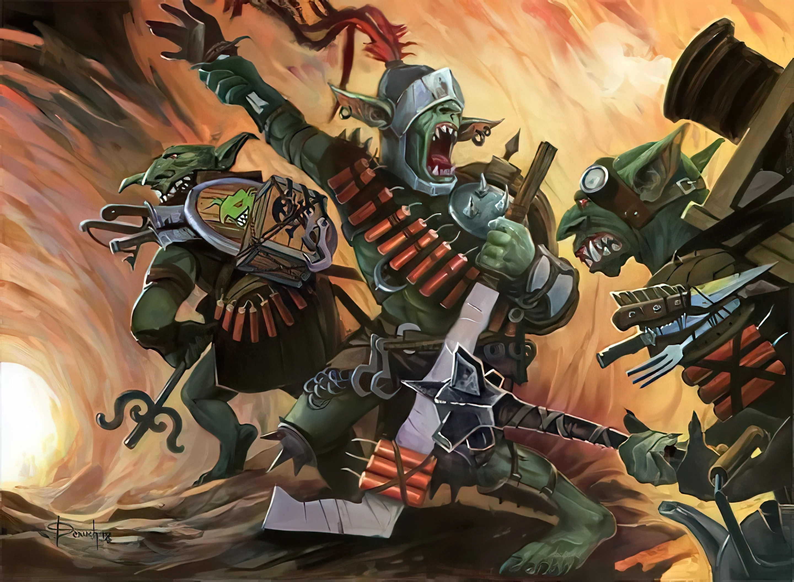

{.size-cover}

# Introduction
A small frontier town is under increasingly more frequent attacks by local goblin forces. Unable to handle the situation themselves, they employ the characters to help discover the reason behind the goblins' aggressive stance and who, if anyone, is organizing them.

### Timeline
>**Act 1**
{.text-center}
>
>The town of Riverdale is under constant attack by goblins. The vile creatures have been pillaging the town and sacking for the past month or so. The characters assist with recovering what was stolen.
{.flowchart}

>**Act 2**
{.text-center}
>
>The characters discover that the goblins have been amassing weapons and troops at the command of a king. Abandoned fortresses and mines have been repurposed by the goblins as staging grounds for raids on the local area. The characters are pressed into service by Mayor Kensey and tasked with finding out why.
{.flowchart-with-link}

>**Act 3**
{.text-center}
>
>The Goblin King prepares his forces for an assualt on Riverdale. The characters and townspeople prepare for the final confrontation.
{.flowchart-with-link}