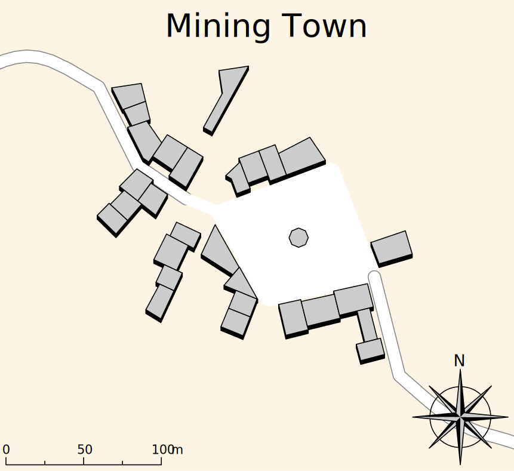

## Finding the Exile
The characters seek out a goblin exile for more information on the goblin king and his plans. Their search takes them to an abandoned mining town. The mine has been closed due to cave-ins in the past. There are three buildings still standing and the rest of the homes in town have been weathered down to rubble.

The general store, tavern, and inn are all situated around the center plaza. they are all in varying stages of rot, with the general store having lost it's roof to a storm long ago.

### 1. General Store
The general store is a medium building about 30 feet in width and 60 feet in length. It has only one floor and no roof. Inside the characters can see 4 rows of shelves lined before them. Each shelf is empty except the odd piece of clutter or debris.

To the right wall sits a half rotted counter. The old store's cash register still standing proud against the decay of time. There is no money inside the cash register.

On the left wall there are posters and adverts that are too faded to be legible.

The hardwood floor of the building has started to rot from years of neglect. Each character attempting to move through the building must beat a DC 9 Dexterity check or slipp and fall prone.

### 2. Tavern
The bar has seen better days, its front door is hanging haphazardly on its hinges. The windows facing the characters are all broken and shattered. Directly in front of the entrance to the tavern, the bar still stands with visible signs of the wood warping under its varnish.

The beams of the tavern are falling apart and occasionally debris will fall to the ground. As characters move around they must succeed a DC 12 Dexterity check or take 1d6 damage.

>Behind the counter is a hidden safe, characters discover it if they succeed a DC 12 Wisdom (Perception) check. The safe can be forced open by beating a DC 14 Strength (Athletics) check or picked open with a DC 14 Dexterity check.
>
>The chest contains 50 gold pieces, 25 silver pieces, rope, and a dagger.

### 4. Inn
Approaching the inn the characters can hear yelling coming from the inside. Before the characters can react a shambling mound bursts forth from the inn, engulfed in flames. The creature lashes out at the nearest character.

After the creature is defeated, Krel, the goblin exile, appears from behind an overturned table and greets the player. He looks hurt but is happy to see them.

### Map

### Conclusion
Krel thanks the characters profusely for saving his life and for defeating the shambling mound. He warns them that the commotion will have attracted the attention of the hunters tasked with killing him. Krel asks the characters to protect him and that if they can get him safely back to town he will help them take down the goblin king.

>From talking to Krel, the characters find out that he had been exiled from the goblin kings royal court for disagreeing with his plans for a civilized goblin society. He goes on to explain that the goblin king seeks to take over riverdale and use it as the basis for his goblin kingdom.