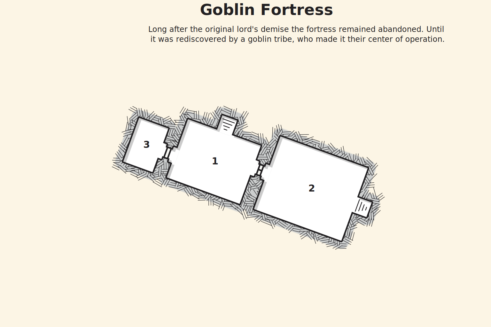

## Goblin Fortress
The characters lead a band of fighters from Riverdale, following the map given to them by Krel, they arrive just beyond the perimeter of the goblin king's compound. The goblin's fortress has been repurposed from an old fort that had be ruined in a war from ages past. They have only recently begun to use it as a base and as such most of the rooms and halls are still inaccessible.

Greg Thompson decides to act as a distraction to allow the characters easier access into the fortress.

### Hook
>You arrive just outside the compounds perimeter. You notice that the area is packed with goblins, most of which look like they had just returned from their failed attack on Riverdale. Some are wounded but most are up and about prepping their battle gear. It looks like the goblins are expecting an attack.
>
>It doesn't seem like you can make it into the keep with this many goblins hanging about. Suddenly, Greg Thompson hatches a daring plan. He volunteers himself and the Riverdale fighters to be a distraction. He assures you that during the commotion an opportunity to enter the Goblin King's fortress should present itself.
>
>Before you can respond Greg rushes the goblins, bellowing a courages war cry. Left with little choice, the fighters from Riverdale join him a second later. Soon chaos erupts before your very eyes and sure enough, a path to the fortress gates opens up...
{.read}

### The Fortress Gate
The fortress gate is about 30 feet tall and shut. As the characters approach it, a large explosion destroys the gates. Characters that fail a DC 12 Dexterity saving throw takes 2d6 fire damage and are prone. Out from the inside the fortress charges the hobgoblin guards and an ogre. The characters proceed into the fortress once they have defeated the guards.

## The Fortress Interior
The following areas correspond to the labels on the provided map.

### 1. Main Hall
The main hall is a large room with trophies from various beasts mounted along the walls. On the floor multiple piles of junk litter the space. Torches are mounted along the walls but they have all been blown out.

The room is rigged with multiple spike traps that are dung into the ground some are lightly buried others are left out in the open. As the characters move about the room they must occasionally make a DC 12 Dexterity saving throw or take 1d6 piercing damage.

Characters may inspect the piles of rubbish around the room. On a failed DC 12 Dexterity check, the pile they are inspecting collapses and the worg in the hall to the throne room (area 2) wakes up.

To the east is a locked wooden door. It can be unlocked by beating a DC 14 Dexterity check. An unlocked wooden door can be found to the west.

### 2. Hall to the Throne Room
The room is lit by two torches on both the eastern and wastern walls. Two worgs sleep in front of the stairs. The worgs awaken if any player steps on a spike trap or otherwise creates any loud noises.

>Characters are able to sneak past the worgs if they succeed on a DC 14 Dexterity (Stealth) check. Alternatively, the characters may keep the worgs occupied long enough to move past it if they have a large amount of meat or food on them.

### 3. Worg Pens
This room smells of dung and beasts. Along the southern walls 3 large and empty cages sit with their gates opened. Bones litter the room and in the corner to the east there is a table with a meat cleaver stuck in it. On the table the characters can find a key to the locked door in the main hall (area 1).

>Characters that beat a DC 12 passive Wisdom (Perception) check notices that the cleaver still has blood on it and following the blood trail they find a large lump of meat hidden under the table.

### Map

### Conclusion
As the characters climb the staircase up to the throne room, they hear shouting and arguments. One voice is Gilena, calm and direct. The other is the Goblin King, Torg the ogre.

Torg is upset about the recent defeat at Riverdale and is angry at Gilena for not killing the characters first.