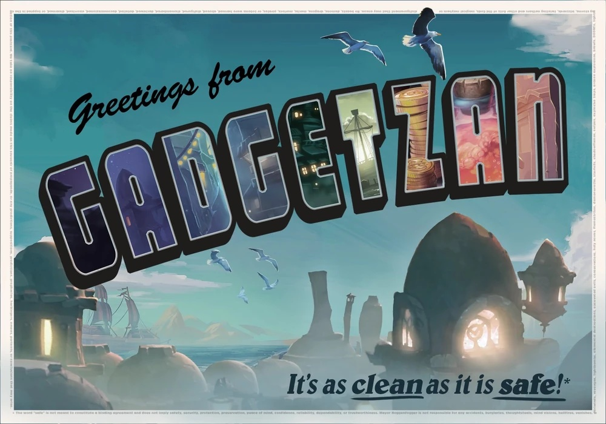

{.size-cover}

# Introduction
The **Greetings from Gadgetzan** adventure module follows the characters as they try to navigate the city's tumultuous environment. Maybe they'll make a name for themselves amongst the rabble or any enemy of one of the ruling gangs, anything is possible in Gadgetzan, the City of Splendor.

### Timeline
>**Goblin King Rises**
{.text-center}
>
>The characters help a small frontier town defend against a growing goblin threat.
{.flowchart}

>**The Mean Streets**
{.text-center}
>
>Upon defeating the Goblin King, Torg, it is revealed that Xanthar had been supporting him in from the shadows. The Crime Lord is not pleased when he learned that his investment was cut, quite literally, short. Now in debt, the characters are forced to assist Xanthar and his organization.
{.flowchart-with-link}

>**Turf War Escalation**
{.text-center}
>
>A rival organization threatens Xanthar's grip on the city of Gadgetzan and must be dealt with.
{.flowchart-with-link}
