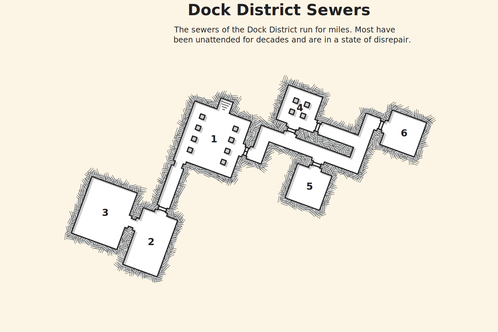

## Lost in the Dark
A small tiefling child stumbles into the tavern after closing time. She timidly asks for help. The child is named Madeg and earlier that day she was playing in the sewer with her little brother. The two were separated when a giant sewer rat attacked. Madeg needs help finding her little brother and is too scared to go back alone. She doesn't want to ask her parents because she doesn't want both of them to get punished.

### Hook
>TBD
{.read}

### Map
